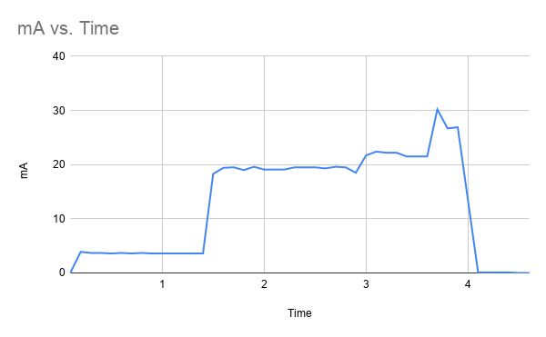
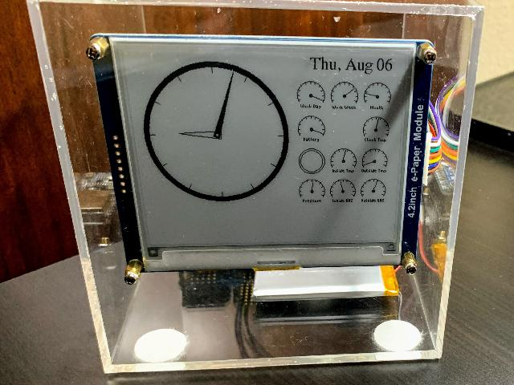

# E-Paper Display

## Disclaimer

This is not an officially supported Google product.

## Introduction

This project was an experiment to make a low-power desktop clock, using an e-paper display.

The low-power thing worked out pretty well. Here is the power consumption, on each update, which happens every ~180 seconds:

It later evolved into a full-featured Raspberry Pi epaper display, which pretty much nixed the low power idea, but added a lot of functionality.

## Software

This clock was my opportunity to experiment with a few different technologies.
1. The original version used TinyGo is in the `microcontroller/tinygo/` subdirectory, running on a Feather M0.
2. The second version, in the `microcontroller/arduino/` subdirectory, was written using conventional Arduino technologies, running on a Feather M0 (and later, a Feather M4). This version worked extremely well and was very low power.
3. The third version, in the `microcontroller/micropython/` subdirectory, was an experiment with Circuit Python (using a Feather M4), but the memory demands were too high with all the fonts and large graphics.
4. The fourth version, in the `microcontroller/rust/` subdirectory, was an incomplete attempt to implement it in Rust on a Feather M0.
5. The fifth version, in the `rpi/python/` subdirectory,  is implemented on a Raspberry Pi, and has a lot more functionality: TrueType fonts, 4-color greyscale with anti-aliasing,
stock charts, etc.

## Hardware

I originally chose almost all Adafruit parts for this project, because they are well made, hassle free, and plug together like Legos.

* Adafruit Feather M0 Express
* Adafruit DS3231 RTC Featherwing
* Adafruit Airlift Featherwing
* Adafruit RTL5111 Reset Timer
* Waveshare 4.2" E-Paper Module
* BME280 Temperature/Pressure/Humidity Sensor

The end result was a clock that runs for months on a small LiPo battery.

(Until I switched to a Raspberry Pi, that is...)